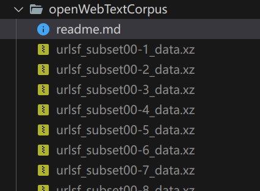
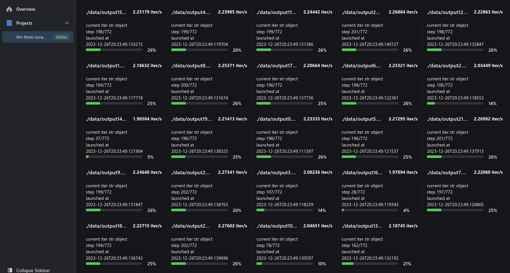
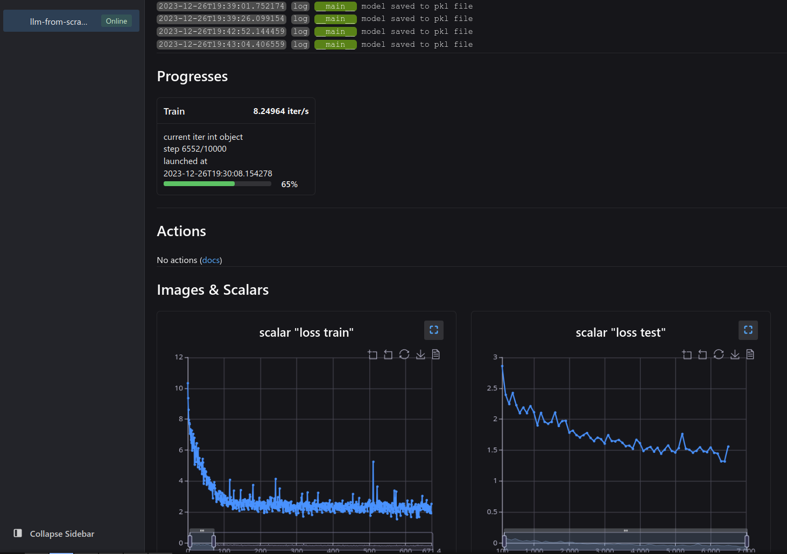
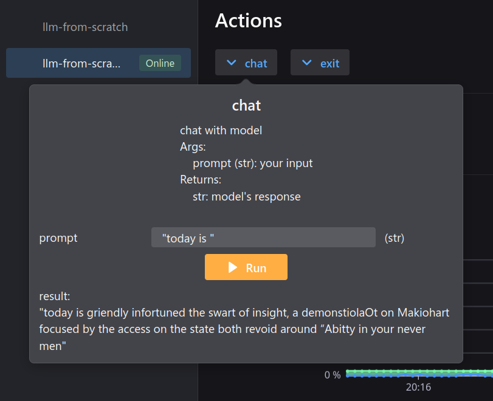

# Hands on Large(?) Language model from scratch


tutorial: [LLM basics from scratch](https://gavin.gong.host/blog/2023/11/19/llm-from-scratch) provide step by step explanation.


---

## how to run

### prepare data

Download from Google drive: [https://drive.google.com/drive/folders/1IaD_SIIB-K3Sij_-JjWoPy_UrWqQRdjx](https://drive.google.com/drive/folders/1IaD_SIIB-K3Sij_-JjWoPy_UrWqQRdjx)

download the file named `openwebtext.tar.xz` from google drive link and **extract** all the `.xz` files in folder `openWebTextCorpus`. 

The files should look like:



after you have downloaded and extracted files above, in terminal:

```bash
python convert_data.py
```

The program automatically convert all the `.xz` files you have extracted in folder `openWebTextCorpus` and put the converted `.txt` files in folder `data`. Since we are using [neetbox][neetbox] for monitoring, open [localhost:20202](http://localhost:20202/) (neetbox's default port) in your browser and you can check the progresses:




### train

```bash
python train.py --config gptv1_s.toml
```

Since we are using [neetbox](https://neetbox.550w.host) for monitoring, open [localhost:20202](http://localhost:20202/) (neetbox's default port) in your browser and you can check the progresses:



### predict

```bash
python inference.py --config gptv1_s.toml
```

Open [localhost:20202](http://localhost:20202/) (neetbox's default port) in your browser and feed text to your model via action button.




---

## further

more information see also [LLM basics from scratch](https://gavin.gong.host/blog/2023/11/19/llm-from-scratch)
